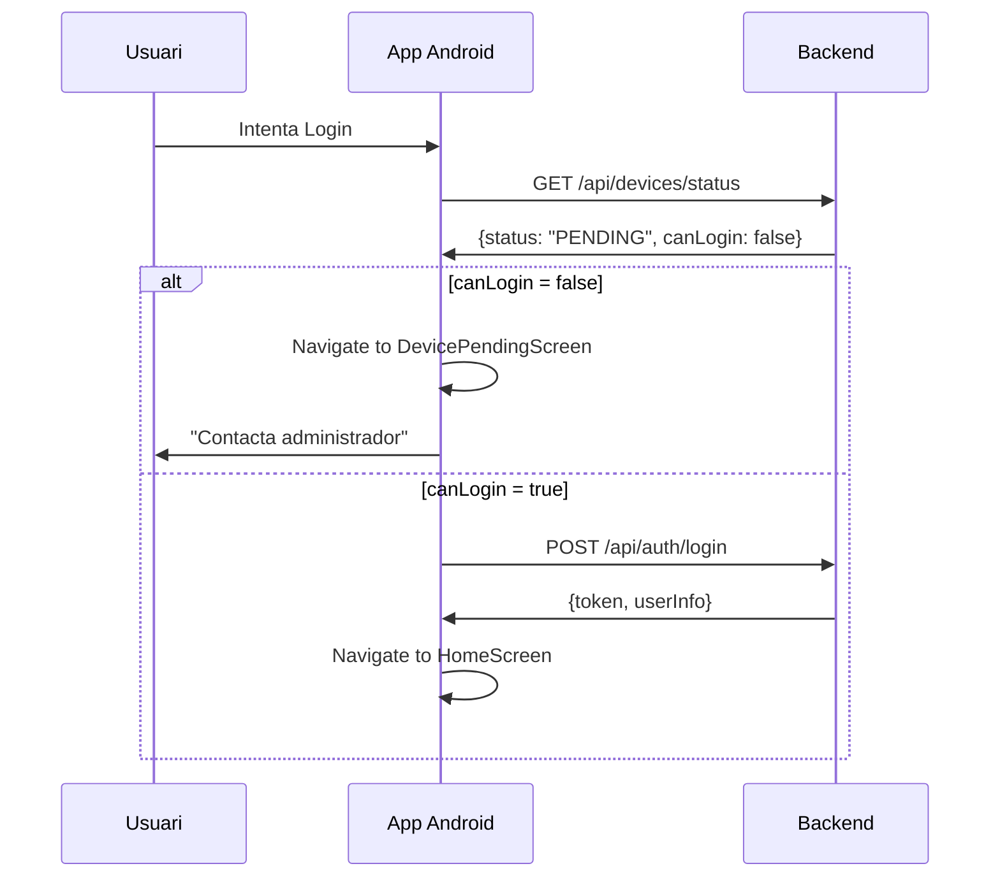

# 🎯 Sistema de Control de Dispositius - IMPLEMENTACIÓ ANDROID COMPLETADA

## ✅ **Implementació Realitzada**

### 1. **Backend (Ja Desplegat)**
- ✅ DeviceAuthorizationFilter corregit (no permet login sense aprovació)
- ✅ Endpoint `/api/devices/status` - verificar si pot fer login
- ✅ Endpoint `/api/devices/my-info` - informació del dispositiu per Settings  
- ✅ Endpoint `/config/app` actualitzat amb versió backend
- ✅ Desplegat a Fly.io versió 114

### 2. **Android (Recién Implementado)**

#### 🔧 **Models i API**
- ✅ `DeviceModels.kt` - DTOs per respostes backend
- ✅ `ApiService.kt` - endpoints nous afegits
- ✅ `ApiClient.kt` - context global per SharedPreferences

#### 🖥️ **Pantalles Noves**
- ✅ `DeviceStatusScreens.kt`:
  - `DevicePendingScreen` - dispositiu pendent aprovació
  - `DeviceRevokedScreen` - dispositiu revocat
- ✅ `SettingsScreen.kt` - informació completa dispositiu i app

#### 🗺️ **Navegació**
- ✅ `Rutes.kt` - noves rutes afegides
- ✅ `AppNavGraph.kt` - rutes configurades
- ✅ `TopBar.kt` - menú "Configuració" afegit

#### 🔐 **Seguretat**
- ✅ `LoginScreen.kt` - verificació dispositiu ABANS del login
- ✅ Navegació automàtica segons estat dispositiu
- ✅ Auto-registre per dispositius nous

## 🏗️ **Arquitectura del Flux de Seguretat**



## 🎯 **Funcionalitats Implementades**

### 1. **Verificació Pre-Login**
```kotlin
private suspend fun checkDeviceStatus(navController: NavController): Boolean {
    val deviceStatus = api.getDeviceStatus()
    if (!deviceStatus.canLogin) {
        when (deviceStatus.status) {
            "PENDING" -> navController.navigate("device_pending")
            "REVOKED" -> navController.navigate("device_revoked") 
            "NOT_REGISTERED" -> {
                // Auto-registre + navigate pending
            }
        }
        return false
    }
    return true
}
```

### 2. **Pantalles Informatives**
- **DevicePendingScreen**: Missatge clar + botó contactar admin
- **DeviceRevokedScreen**: Notificació revocació + informació contacte
- **SettingsScreen**: Informació completa dispositiu + versions

### 3. **Menú Configuració**
- Accessible des del menú "..." de la TopBar
- Mostra versió app, backend, estat dispositiu
- Informació de seguretat Play Integrity

## 🧪 **Pla de Testing**

### Escenaris Crítics a Provar:

#### Test 1: Dispositiu Nou
```
1. Instal·lar app en dispositiu nou
2. Intentar login
3. Verificar: Auto-registre + navegació a "device_pending"
4. Verificar: No accés a funcionalitats principals
```

#### Test 2: Dispositiu Pendent  
```
1. Dispositiu registrat com PENDING al backend
2. Intentar login
3. Verificar: Navegació directa a "device_pending"
4. Verificar: Missatge informatiu correcte
```

#### Test 3: Dispositiu Aprovat
```
1. Aprovar dispositiu des del backend
2. Intentar login amb credencials correctes
3. Verificar: Login normal + accés complet
```

#### Test 4: Dispositiu Revocat
```
1. Revocar dispositiu des del backend  
2. Intentar login
3. Verificar: Navegació a "device_revoked"
4. Verificar: Missatge de revocació
```

#### Test 5: Menú Configuració
```
1. Login correcte amb dispositiu aprovat
2. Accedir menú "..." → "Configuració"
3. Verificar: Versions app/backend correctes
4. Verificar: Estat dispositiu = "Aprovat"
```

## 🔄 **Següents Passos**

### 1. **Testing Immediat**
1. Generar APK de debug: `./gradlew assembleDevDebug`
2. Instal·lar en dispositiu de test
3. Executar escenaris de test

### 2. **Ajustos si necessari**
- Revisar missatges d'error/informació
- Ajustar temps d'espera de xarxa
- Afinar UX de les pantalles noves

### 3. **Versió de Producció**
- Generar AAB amb nova versió (1.2.6?)
- Actualizar MIN_SUPPORTED_VERSION al backend
- Desplegar següent versió

## 📊 **Estat del Sistema**

| Component | Estat | Descripció |
|-----------|-------|------------|
| Backend | ✅ Desplegat | Versió 114 amb tots els endpoints |
| Android API | ✅ Implementat | Tots els endpoints configurats |
| Pantalles | ✅ Implementat | Device pending/revoked/settings |
| Navegació | ✅ Implementat | Rutes i flux de seguretat |
| Verificació | ✅ Implementat | Pre-login device check |
| Menú Config | ✅ Implementat | Accessible des de TopBar |
| Compilació | ✅ Funciona | Build successful |

## 🎉 **Resultat Final**

**Sistema complet de control de dispositius implementat:**
- ✅ Seguretat: Dispositius no aprovats NO poden fer login
- ✅ UX: Pantalles informatives clares per cada estat
- ✅ Transparència: Menú configuració amb tota la informació
- ✅ Automàtic: Auto-registre de dispositius nous
- ✅ Robust: Gestió d'errors i fallbacks

**L'aplicació està llesta per testing! 🚀**