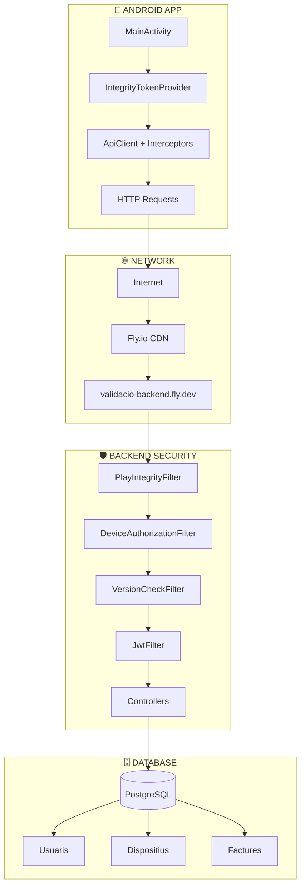
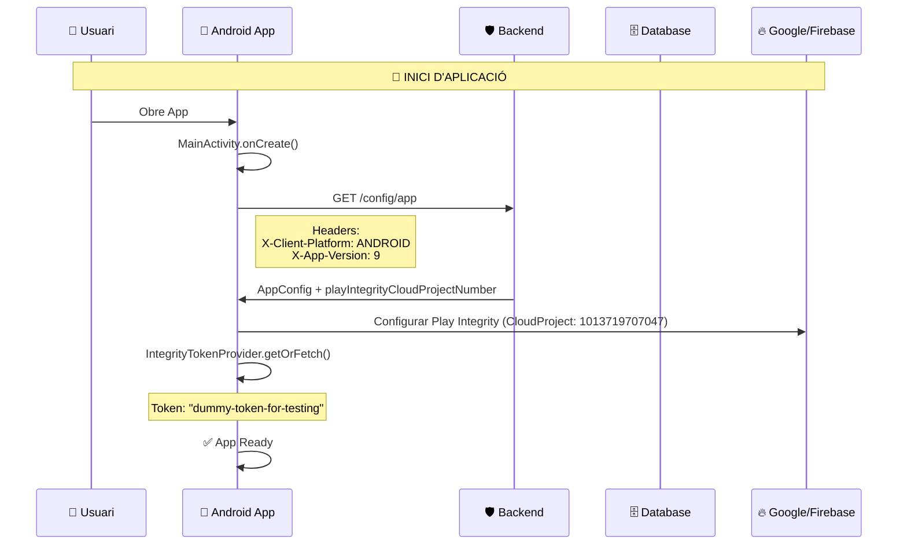
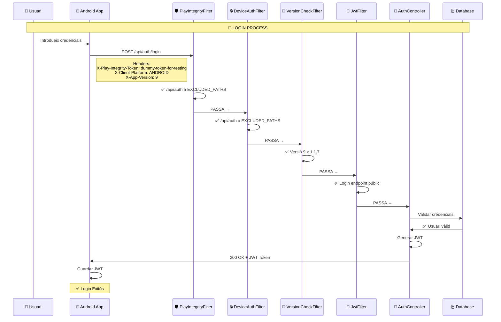
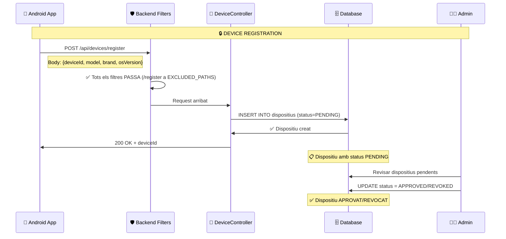
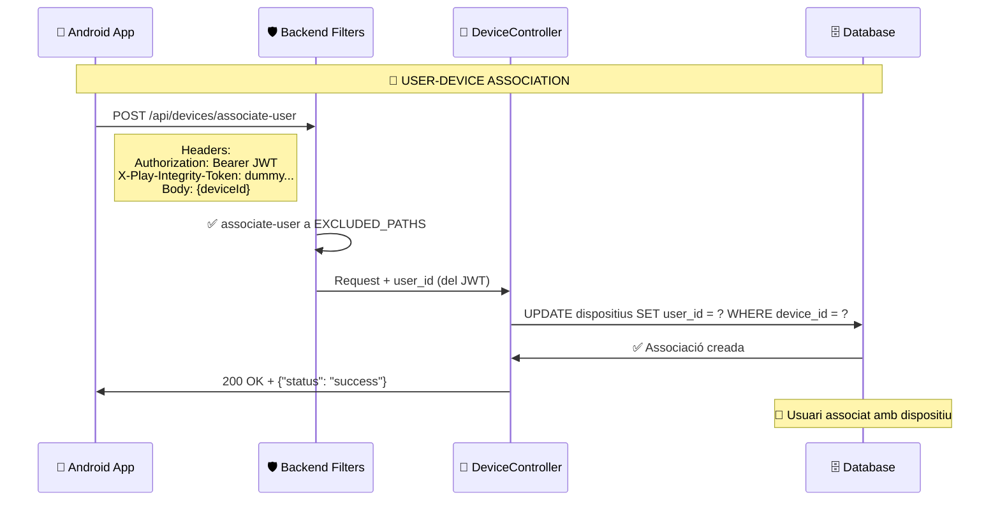
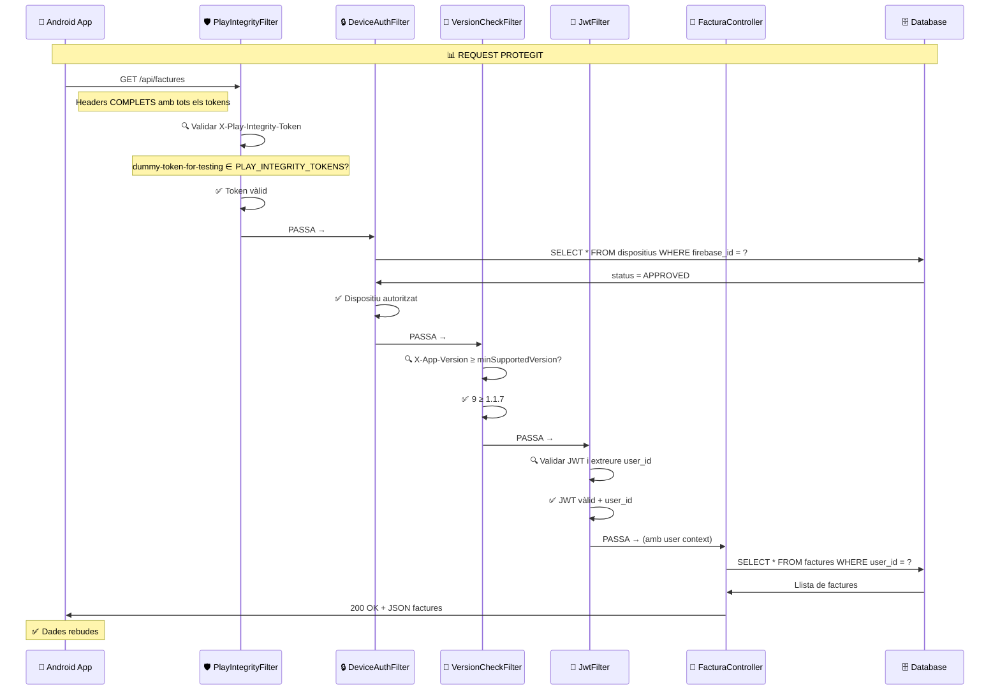
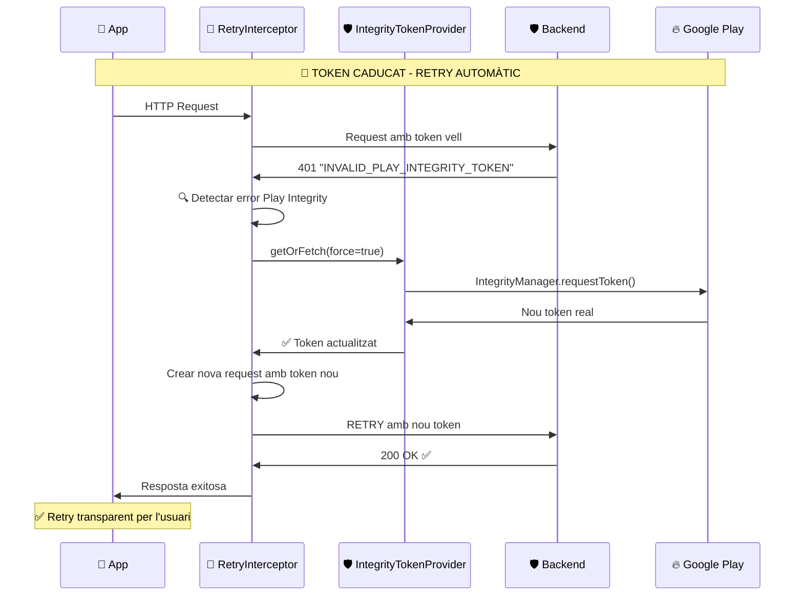
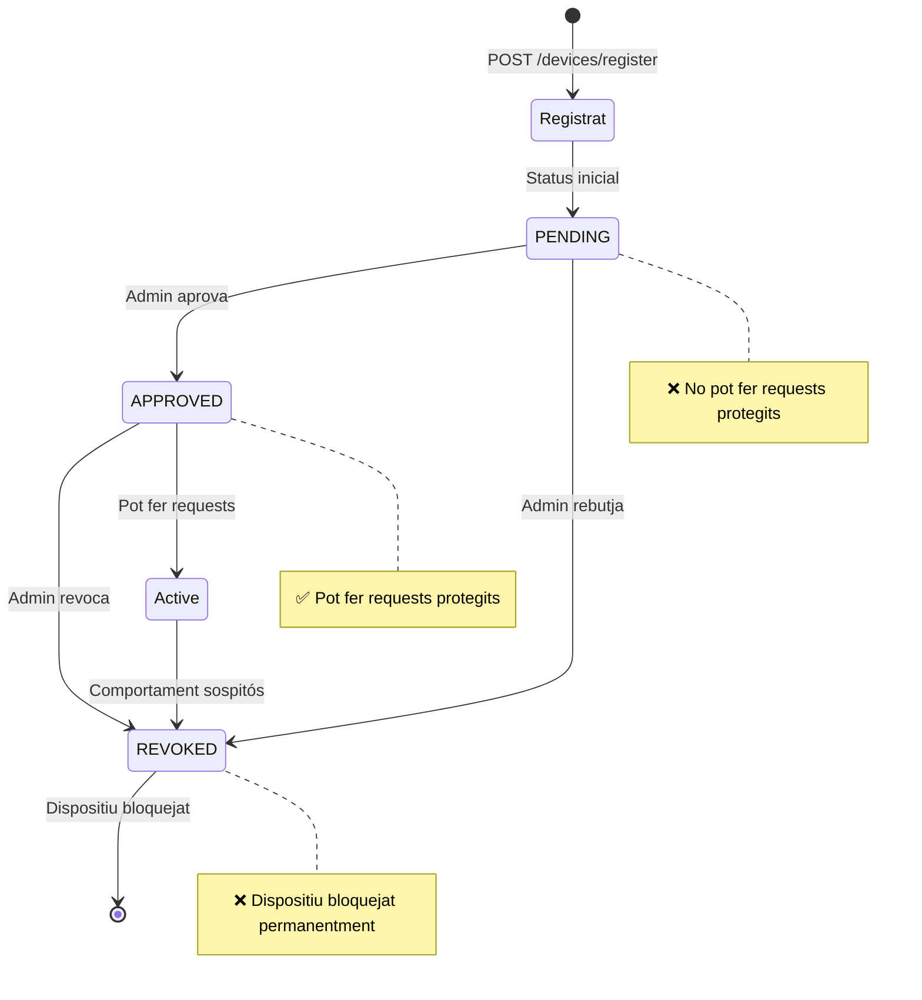
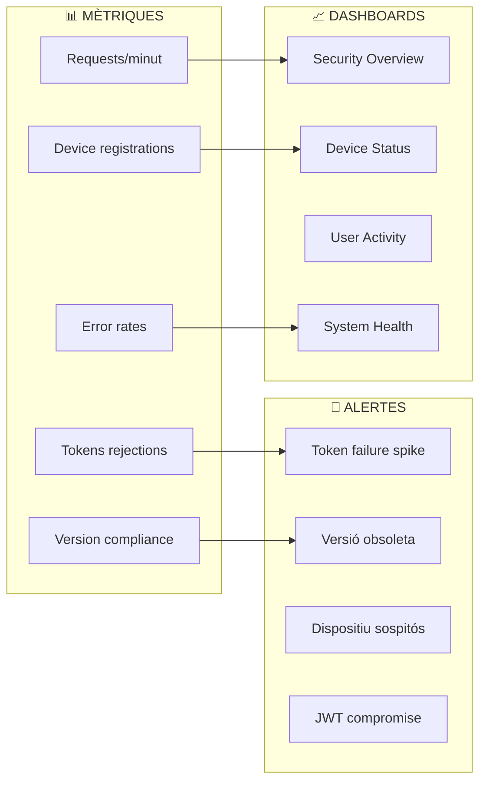

# 🧠 Mapa Mental - Sistema Validació Factures

## 🎯 **Vista General del Sistema**



---

## 🔄 **Flux d'Inici d'Aplicació**



---

## 🔑 **Flux de Login**



---

## 🔒 **Flux de Registre de Dispositiu**



---

## 🔗 **Flux d'Associació Usuari-Dispositiu**



---

## 📊 **Flux de Request Protegit**



---

## 🔄 **Sistema de Retry Automàtic**



---

## 🎯 **Mapa d'Endpoints i Seguretat**

```mermaid
graph TB
    subgraph "🟢 PÚBLICS (EXCLUDED_PATHS)"
        E1[/config/app] 
        E2[/ping]
        E3[/api/auth/login]
        E4[/api/devices/register]
        E5[/api/devices/associate-user]
    end
    
    subgraph "🔴 PROTEGITS (4 FILTRES)"
        P1[/api/factures/*]
        P2[/api/albarans/*]
        P3[/api/ots/*]
        P4[/api/pressupostos/*]
        P5[/api/usuaris/*]
    end
    
    subgraph "🛡️ FILTRES DE SEGURETAT"
        F1[PlayIntegrityFilter @Order1]
        F2[DeviceAuthFilter @Order2]
        F3[VersionCheckFilter @Order3]
        F4[JwtFilter @Order4]
    end
    
    E1 --> OK1[✅ Directe]
    E2 --> OK2[✅ Directe]
    E3 --> OK3[✅ Directe]
    E4 --> OK4[✅ Directe]
    E5 --> OK5[✅ Directe]
    
    P1 --> F1
    P2 --> F1
    P3 --> F1
    P4 --> F1
    P5 --> F1
    
    F1 --> F2
    F2 --> F3
    F3 --> F4
    F4 --> OK[✅ Controller]
```

---

## 📱 **Estats de Dispositius**



---

## ⚙️ **Variables de Configuració**

```mermaid
mindmap
  root)🔧 CONFIGURACIÓ(
    📱 Android
      BuildConfig
        BASE_URL
        VERSION_CODE
        DEBUG
      Firebase
        Project: 1013719707047
        SHA1: configurada
    🛡️ Backend
      Play Integrity
        ENABLED: true
        TOKENS: dummy-token-for-testing
        PROJECT: 1013719707047
      Versions
        MIN_SUPPORTED: 1.1.7
        UPDATE_MSG: Cal actualitzar...
        UPDATE_URL: Google Play
      Debug
        ENDPOINTS_ENABLED: false
    🗄️ Database
      Usuaris
        id, username, password_hash
      Dispositius
        id, device_id, firebase_id, status
        user_id (FK), created_at
      Factures
        id, referencia, import_total
        user_id (FK), proveidor_id
```

---

## 🚀 **Procediments de Deploy**

```mermaid
gitgraph
    commit id: "Init"
    branch android-updates
    commit id: "v1.1.8"
    commit id: "Play Integrity"
    commit id: "v1.1.9"
    checkout main
    merge android-updates
    
    branch backend-security  
    commit id: "4-layer filters"
    commit id: "PlayIntegrity API"
    commit id: "Device Authorization"
    checkout main
    merge backend-security
    
    branch production-ready
    commit id: "Remove dummy tokens"
    commit id: "Real Play Integrity"
    commit id: "Production deploy"
```

---

## 📊 **Mètriques i Monitoratge**



---

## 🎯 **Resum dels Components Clau**

| Component | Responsabilitat | Estat |
|-----------|----------------|-------|
| **PlayIntegrityFilter** | Validar tokens Google Play | ✅ Implementat |
| **DeviceAuthorizationFilter** | Control dispositius aprovats | ✅ Implementat |
| **VersionCheckFilter** | Control versions mínimes | ✅ Implementat |
| **JwtFilter** | Autenticació usuaris | ✅ Implementat |
| **IntegrityTokenProvider** | Gestió tokens Android | ✅ Implementat |
| **PlayIntegrityRetryInterceptor** | Retry automàtic | ✅ Implementat |
| **AppConfig API** | Configuració dinàmica | ✅ Implementat |

---

*Mapa Mental generat: 9 Octubre 2025*  
*Versió Sistema: Android 1.1.9 + Backend Latest*