# 🔐 Sistema de Control de Dispositius - IMPLEMENTAT

## ✅ **Canvis Backend Completats**

### 1. **DeviceAuthorizationFilter Millorat**
- ❌ **ABANS**: `/api/auth` era exclòs → qualsevol dispositiu podia fer login
- ✅ **DESPRÉS**: Només `/api/devices/register`, `/api/devices/status` i endpoints específics exclosos
- 🛡️ **Resultat**: Dispositius pendents/revocats **NO** poden fer login

### 2. **Nous Endpoints Implementats**

#### `/api/devices/status` (GET)
```json
{
  "status": "PENDING|APPROVED|REVOKED|NOT_REGISTERED",
  "message": "Missatge informatiu per l'usuari",
  "canLogin": false
}
```

#### `/api/devices/my-info` (GET) 
```json
{
  "fid": "dispositiu-id",
  "status": "PENDING",
  "appVersion": "1.2.5",
  "associatedUser": "admin@admin.com",
  "registrationDate": null
}
```

#### `/config/app` (GET) - Actualitzat
```json
{
  "minSupportedVersion": "1.2.5",
  "message": "Actualització disponible",
  "updateUrl": "https://play.google.com/store/...",
  "playIntegrityCloudProjectNumber": 1013719707047,
  "backendVersion": "1.13.0"
}
```

### 3. **Flux de Seguretat Implementat**

```mermaid
graph TD
    A[App Android] --> B{Dispositiu registrat?}
    B -->|No| C[Auto-registre PENDING]
    B -->|Sí| D[Verificar estat]
    D --> E{Estat dispositiu}
    E -->|PENDING| F[Pantalla: Contacta Admin]
    E -->|REVOKED| G[Pantalla: Dispositiu Revocat]
    E -->|APPROVED| H[Permetre Login]
    F --> I[❌ No pot accedir a l'app]
    G --> I
    H --> J[✅ Accés complet a l'app]
```



## 🚧 **Pendent Implementació Android**

### 1. **Crear API Client per Dispositius**
```kotlin
// DevicesApiService.kt
interface DevicesApiService {
    @GET("devices/status")
    suspend fun getDeviceStatus(): DeviceStatusResponse
    
    @GET("devices/my-info") 
    suspend fun getMyDeviceInfo(): DeviceInfoResponse
}
```

### 2. **Pantalla de Dispositiu Pendent**
```kotlin
// DevicePendingScreen.kt
@Composable
fun DevicePendingScreen(deviceStatus: DeviceStatusResponse) {
    Column(
        modifier = Modifier.fillMaxSize(),
        horizontalAlignment = Alignment.CenterHorizontally,
        verticalArrangement = Arrangement.Center
    ) {
        Icon(Icons.Default.HourglassEmpty, "Pending")
        Text("Dispositiu Pendent d'Aprovació")
        Text(deviceStatus.message)
        Button(onClick = { /* Contactar admin */ }) {
            Text("Contactar Administrador")
        }
    }
}
```

### 3. **Modificar LoginScreen**
```kotlin
// LoginScreen.kt - Afegir verificació abans del login
LaunchedEffect(Unit) {
    val deviceStatus = devicesApiService.getDeviceStatus()
    if (!deviceStatus.canLogin) {
        navController.navigate("device_pending")
        return@LaunchedEffect
    }
}
```

### 4. **Pantalla Settings**
```kotlin
// SettingsScreen.kt
@Composable
fun SettingsScreen() {
    val deviceInfo by viewModel.deviceInfo.collectAsState()
    val appConfig by viewModel.appConfig.collectAsState()
    
    LazyColumn {
        item { AppVersionSection(appConfig) }
        item { DeviceInfoSection(deviceInfo) }
        item { SecurityStatusSection(deviceInfo) }
    }
}

@Composable
fun DeviceInfoSection(deviceInfo: DeviceInfoResponse) {
    Card {
        Column {
            Text("Informació del Dispositiu")
            Text("ID: ${deviceInfo.fid.take(8)}...")
            Text("Estat: ${deviceInfo.status}")
            Text("Versió App: ${deviceInfo.appVersion}")
            Text("Usuari: ${deviceInfo.associatedUser}")
        }
    }
}
```

### 5. **Navigation Updates**
```kotlin
// Afegir noves rutes
NavHost {
    composable("device_pending") { DevicePendingScreen() }
    composable("device_revoked") { DeviceRevokedScreen() }
    composable("settings") { SettingsScreen() }
}
```

## 🎯 **Prioritats d'Implementació**

### Fase 1: CRÍTICA (Seguretat)
1. ✅ Backend: DeviceAuthorizationFilter fix
2. ✅ Backend: Endpoints de status
3. 🔄 Android: API Client per dispositius
4. 🔄 Android: Verificació abans del login

### Fase 2: IMPORTANT (UX)
5. 🔄 Android: Pantalla dispositiu pendent
6. 🔄 Android: Pantalla dispositiu revocat
7. 🔄 Android: Navegació condicionada

### Fase 3: INFORMATIU (Settings)
8. 🔄 Android: Pantalla Settings completa
9. 🔄 Android: Informació dispositiu
10. 🔄 Android: Versions app/backend

## 🧪 **Testing Pla**

### Escenaris a Provar:
1. **Dispositiu nou** → Auto-registre → Pantalla pendent
2. **Dispositiu pendent** → Intent login → Bloqueig
3. **Dispositiu aprovat** → Login normal → Accés complet
4. **Dispositiu revocat** → Intent login → Pantalla error
5. **Settings menu** → Mostrar info dispositiu correcta

### Test Cases Backend (YA IMPLEMENTADOS):
```bash
# Test 1: Dispositiu pendent no pot fer login
curl -H "X-Firebase-Installation-Id: pending-device" \
     -H "X-Client-Platform: ANDROID" \
     "https://validacio-backend.fly.dev/api/auth/login"
# Expected: 403 Forbidden

# Test 2: Status endpoint funciona
curl -H "X-Firebase-Installation-Id: pending-device" \
     "https://validacio-backend.fly.dev/api/devices/status"
# Expected: {"status":"PENDING","canLogin":false,...}
```

## 📋 **Estat Actual**

- ✅ **Backend**: Completament implementat i desplegat
- 🔄 **Android**: Pendent implementació
- 🎯 **Objectiu**: Sistema de control de dispositius 100% funcional

**Següent pas**: Implementar la part Android segons el pla especificat.